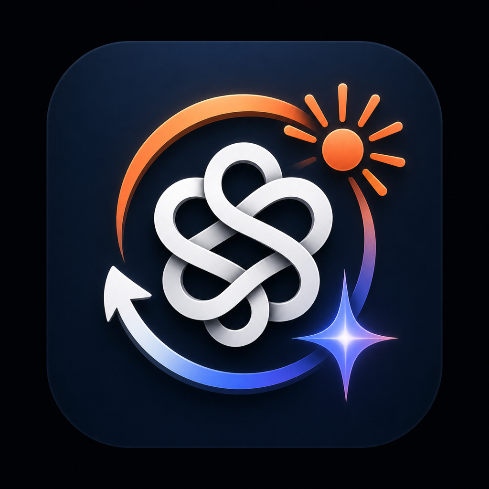

<h1>
  
  ChatRelay
</h1>

ChatRelay is an invisible macOS helper that moves conversation context between the native ChatGPT, Claude, and Gemini apps through one Markdown file in an Obsidian vault.

Type `\handoff` in one chat to save the current context. Type `\resume` in a new chat to continue from it.

## Requirements

- macOS 14 or newer
- Xcode Command Line Tools or Xcode
- Native ChatGPT, Claude, or Gemini for macOS
- An existing Obsidian vault

## Install

Clone and enter the repository:

```sh
git clone https://github.com/tanishsidhu/ChatRelay.git
cd ChatRelay
```

Build ChatRelay:

```sh
Scripts/build-app.sh release
```

Configure the Obsidian vault that should contain the handoff:

```sh
.build/app/ChatRelay.app/Contents/MacOS/chatrelayctl configure --vault "$HOME/Documents/Obsidian/Context"
```

Replace the example path if your vault is somewhere else. ChatRelay creates `Handoffs/CURRENT_HANDOFF.md` inside that vault after the first successful handoff.

Install and launch the background app:

```sh
Scripts/install-app.sh
```

The default installation is `$HOME/Applications/ChatRelay.app`. To install in `/Applications` instead:

```sh
CHATRELAY_INSTALL_DIR=/Applications Scripts/install-app.sh
```

## Grant permission

1. Open System Settings.
2. Go to **Privacy & Security > Accessibility**.
3. Add and enable `ChatRelay.app` from the installation directory.
4. Launch ChatRelay again.

ChatRelay has no window, Dock icon, or menu-bar item. It registers itself to start at login.

## Use

In an existing conversation, type exactly:

```text
\handoff
```

Press Return. ChatRelay replaces the command with a structured context request. Keep that chat visible until you see the "Handoff saved" notification. When the marked response is complete and valid, ChatRelay atomically replaces `Handoffs/CURRENT_HANDOFF.md`.

In a fresh chat in another supported app, type exactly:

```text
\resume
```

Press Return. ChatRelay inserts the saved handoff and submits it.

These triggers use a backslash prefix so they do not collide with provider slash-command menus. Other backslash-prefixed messages are ignored.

Do not use `\handoff` as the first message in an empty chat. There is no conversation to summarize, and a provider may fall back to its own saved memory.

## Check the installation

```sh
"$HOME/Applications/ChatRelay.app/Contents/MacOS/chatrelayctl" doctor
```

The report shows permissions, supported app discovery, configured vault readiness, and whether a handoff file exists. It never prints conversation or handoff contents.

## Privacy

- ChatRelay runs locally and uses no model API, server, account token, or analytics.
- It monitors Return only in supported native app bundle identifiers.
- Responses stay in memory except for the validated current handoff.
- Partial or malformed responses never replace the previous valid file.
- The handoff directory should remain excluded from vault Git synchronization.
